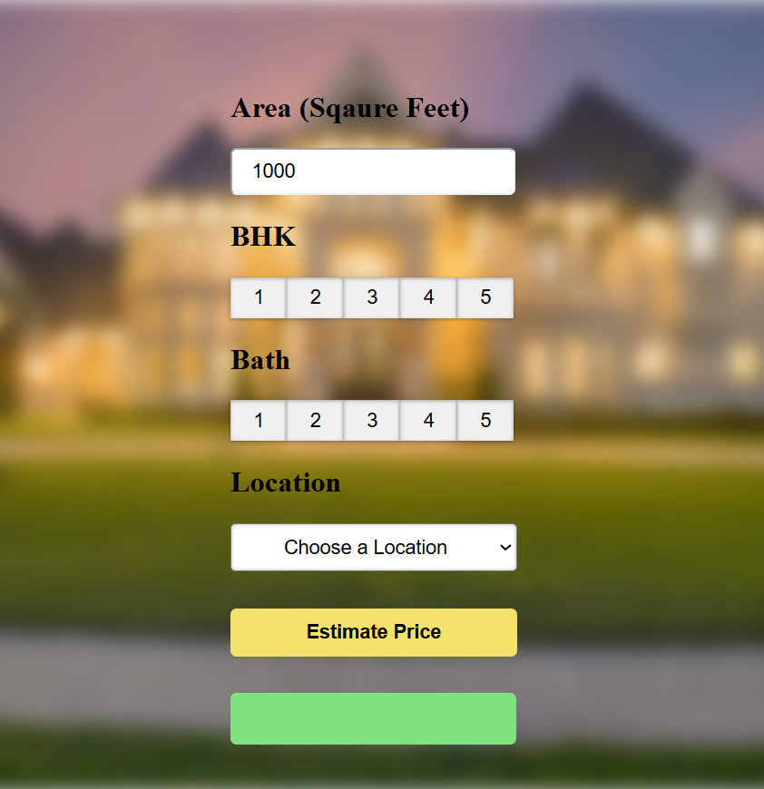
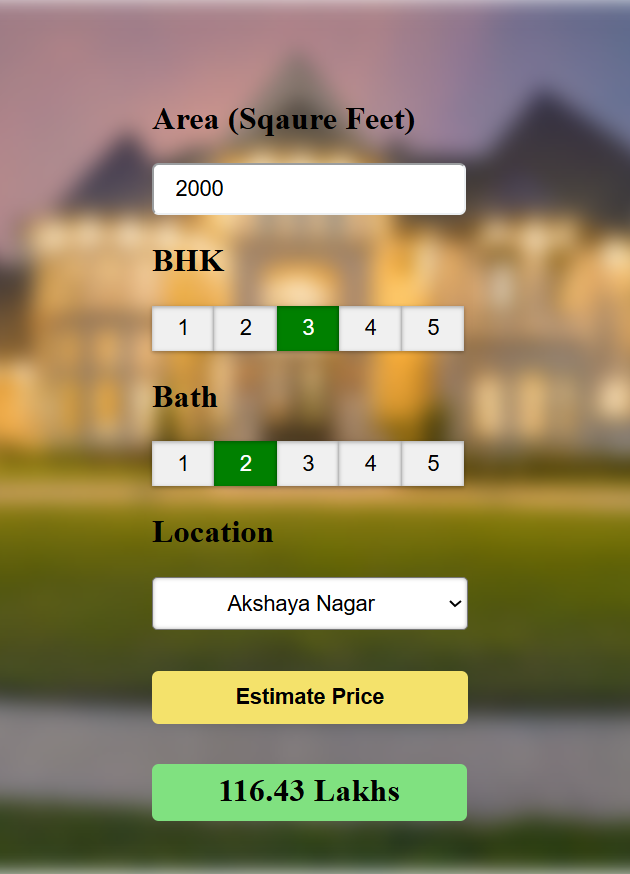

# 🏠 Bangalore House Price Prediction App

This is an end-to-end machine learning project that predicts house prices in Bangalore based on user inputs such as location, square footage, number of bedrooms (BHK), and bathrooms. The model is served via a Flask backend and is connected to a modern, interactive frontend built with HTML, CSS, and JavaScript.

---

## 📌 Features

- 🔢 Predict prices based on total square feet, BHK, bath, and location
- 🌍 240+ locality options across Bangalore
- ⚡ Real-time price prediction via RESTful API
- 💻 Intuitive and responsive user interface
- 🧠 Integrated ML model trained on cleaned housing data
- 🔗 Seamless backend-frontend connection using Flask & Fetch API

---

## 🛠 Tech Stack

| Layer       | Tech Used                              |
|-------------|----------------------------------------|
| Frontend    | HTML, CSS, JavaScript                  |
| Backend     | Python, Flask, Flask-CORS              |
| ML/Modeling | scikit-learn, pandas, NumPy            |
| Others      | Pickle (for saving trained model), JSON|

---

## 🚀 Project Structure

├── artifacts/
│ ├── banglore_home_prices_model.pickle
│ └── columns.json
├── templates/
│ └── app.html
├── static/
│ ├── app.css
│ └── app.js
├── server.py
├── util.py

---


> 📁 `artifacts/`: Stores the trained ML model and feature columns  
> 📁 `templates/` and `static/`: Contain frontend files  
> 🧠 `util.py`: Handles prediction logic and model loading  
> 🔌 `server.py`: Flask server that routes API calls

---

## ⚙️ How to Run Locally

### 1. Clone the Repository
```bash
git clone https://github.com/your-username/bangalore-house-price-prediction.git
cd bangalore-house-price-prediction
```
### 2. Create a Virtual Environment (Optional but Recommended)
```bash
python -m venv venv
source venv\Scripts\activate
```
3. Install Dependencies\
```bash
pip install -r requirements.txt
```

## If requirements.txt is not present, install manually:
```bash
pip install flask flask-cors pandas numpy scikit-learn
```

### 4. Run the Flask Server
```bash
python server.py
```

### 5. Open the Frontend
- Just open the app.html file in any browser (ensure Flask is running on localhost:5000).

## 🧠 Model Overview
- Algorithm Used: Linear Regression
- Features Used:
- Total square feet
- Number of bathrooms
- Number of BHK
- One-hot encoded location
- Training Data: Bangalore housing dataset (cleaned)

### 🖼 Homepage UI


### 📊 Prediction Example



## 🧩 Future Improvements
- Host it online (Render/Heroku/Vercel)
- Add model training notebook and dataset
- Improve model accuracy with better feature engineering
- Extend support for other cities
- Use a database for storing user queries

## 🤝 Contributing
- Contributions are welcome! Feel free to fork the repo and submit a pull request.

### 👨‍💻 Author
- Aditya Roy
- 📬 LinkedIn: [https\\linkedin.com](https://www.linkedin.com/in/aditya-roy18)
- 📧 [adityaroyofficial20@gmail.com](https://mail.google.com/adityaroyofficial20@gmail.com)